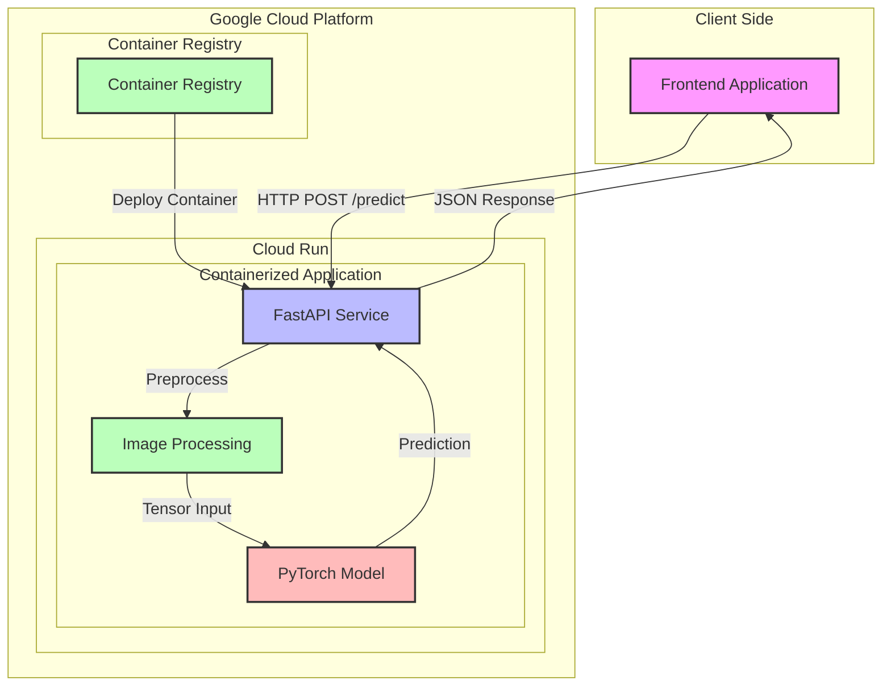
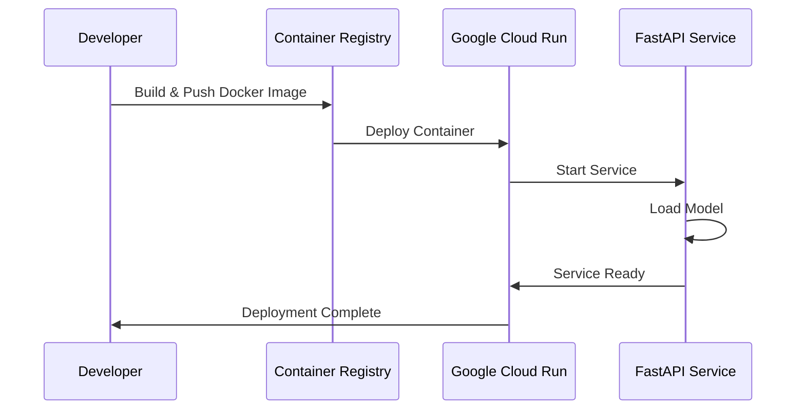

# System Architecture



## Components Description

### Client Side
- **Frontend Application**: Web or mobile application that allows users to upload images and displays prediction results
- Communicates with the API using HTTP requests
- Handles image upload using multipart/form-data

### Google Cloud Platform
- **Cloud Run**: Serverless platform hosting our containerized FastAPI service
- **Container Registry**: Stores and manages our Docker container images
- Provides auto-scaling and load balancing

### Containerized Application
- **FastAPI Service**: Handles HTTP requests and responses
- **PyTorch Model**: The machine learning model for inference
- **Image Processing**: Handles image preprocessing (resize, normalize, etc.)
- All components run within the same container

### Data Flow
1. Frontend sends image via HTTP POST request
2. FastAPI receives multipart form data
3. Image preprocessing (resize, normalize, etc.)
4. Model inference
5. JSON response with predictions

## Deployment Flow



## API Endpoints

```mermaid
graph LR
    subgraph "API Endpoints"
        GET[GET /] -->|Health Check| RESP1[{"message": "API is running"}]
        POST[POST /predict] -->|Image Upload| RESP2[{"predicted_class": 0, "confidence": 0.95}]
    end
``` 